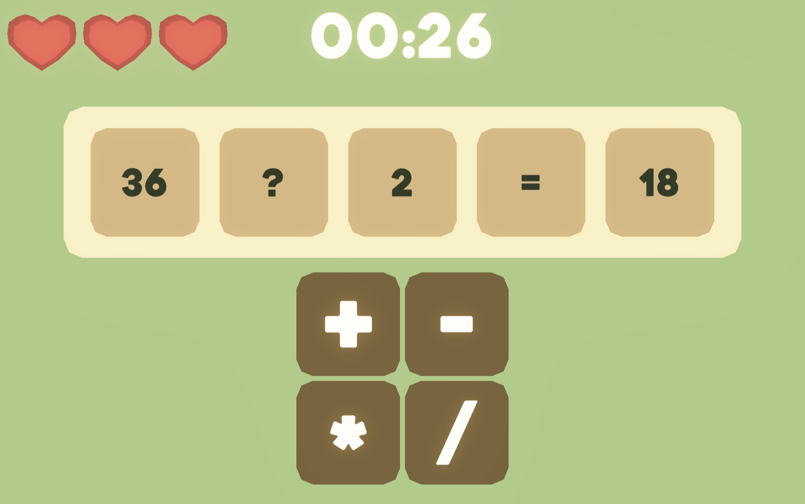

# ExerMath
Fast-paced math puzzle game built with Unity/C#.

Solve equations by choosing the correct mathematical operator before time runs out.
Features three difficulty modes, a penalty system, and a high score tracker.

**Play in browser:** https://spiky789.itch.io/exermath

## Built with
- Unity (C#)
- WebGL export

## Screenshots

